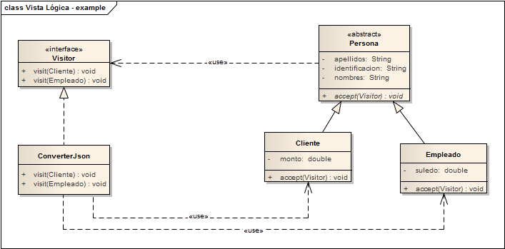

# PatternVisitor - Example

## Propósito

Representar operaciones sobre los elementos de una estructura de objetos, Permitiendo definir una nueva operación sin cambiar las clases de los elementos sobre los que opera.

Patrón Visitor proporciona una forma fácil y sostenible de ejecutar acciones en una familia de clases. Este patrón Proporciona un marco genérico para soportar nuevas operaciones, y permite que sean modificados o ampliados sin cambiar las clases sobre las que actúan.